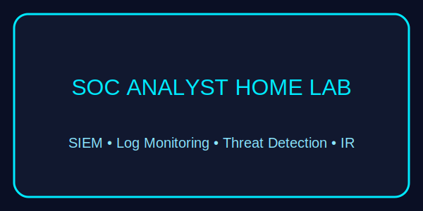
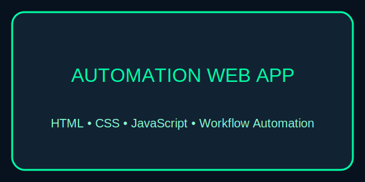

  

<h1 align="center">💻 Fortune Owivri — IT Support & Cybersecurity Portfolio</h1>

  <b>IT Support • Cybersecurity (Entry-Level SOC) • System Optimization • Troubleshooting</b>

---

## 👋 About Me

I am an IT Support and Cybersecurity–driven professional with hands-on experience in technical troubleshooting, system optimization, ticket-based support, and foundational security analysis.  
I enjoy diagnosing problems, improving systems, and helping organizations build secure, reliable IT environments.

This portfolio showcases practical projects that demonstrate:
- IT Support & troubleshooting
- SOC analyst readiness
- SIEM monitoring & log analysis
- Basic incident response
- Web app development (lightweight automation)
- Documentation & technical reporting

---

# ⚡ Skills & Tools

### 🖥️ **Technical Skills**
- IT Support • Help-Desk • Remote Desktop Support  
- Windows OS • Basic Linux • Networking (CCNA level)  
- System Optimization • Troubleshooting • Ticketing  
- SIEM Basics (Splunk/Wazuh)  
- Log Monitoring • Basic Incident Response  
- HTML • CSS • JavaScript  

### 🧰 **Tools**
- Git & GitHub  
- VS Code  
- VirtualBox  
- Windows Admin Tools  
- Google Workspace  
- Remote Support Tools (RDP, AnyDesk, etc.)

---

# 🏅 Badges

  
  
  
  
  

📂 **Folder:** [IT Support Case Study](./IT_Support_Case_Study)  
📝 Includes real troubleshooting, downtime reduction, and system optimization results.

---

### 2️⃣ SOC Analyst Home Lab — SIEM Monitoring & Threat Detection

  

📂 **Folder:** [SOC Home Lab Project](./SOC_Home_Lab_Project)  
🛡 Shows SIEM setup, log analysis, detection rules, and a sample incident response report.

---

### 3️⃣ Inventory Automation Web App — Workflow Optimization

  

📂 **Folder:** [Automation Web App Project](./Automation_Web_App_Project)  
⚙ A lightweight JavaScript tool for workflow automation and efficiency improvement.

---

